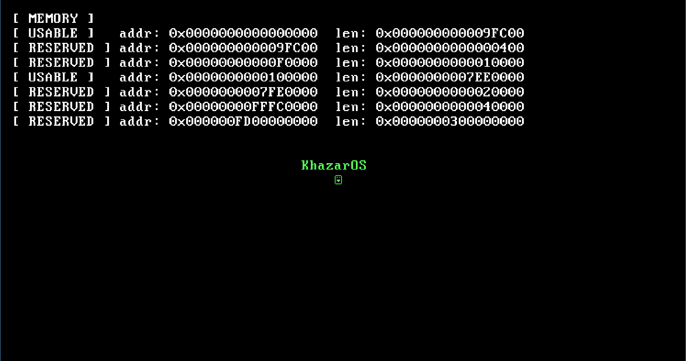

# Khazar

<!-- SPDX-License-Identifier: MIT -->

## Khazar is a minimal, educational 64-bit operating system kernel.

## Features
- **64-bit Long Mode** — Transition from 32-bit protected mode with CPUID compatibility checks.
- **Paging** — 1 GiB identity mapping configured using 2 MiB huge pages.
- **Interrupts & GDT** — Global Descriptor Table initialization and IDT setup with remapped PIC interrupts (exceptions + IRQs).
- **VGA Text Mode** — Text console driver supporting colors, automated hardware-based scrolling, and cursor control.
- **Drivers** — Simple keyboard callback (IRQ1) and PIT sleep timer support.
- **Memory Map** — Multiboot-compliant system memory map parsing (usable vs reserved RAM).

## Layout
- `src/boot` — Multiboot entry point, assembly-level paging initialization, and long mode entry.
- `src/kernel` — Kernel main entry loop and logic.
- `src/cpu` — CPU architecture setup including GDT, IDT, and Interrupt Service Routines (ISRs).
- `src/drivers` — Device controllers including keyboard, PIT timer, VGA text console, and low-level IO.
- `src/memory` — Memory management subsystems (PMM).
- `src/include` — Shared public headers mirrored to the source layout.
- `src/iso` — GRUB configuration templates and image build environment.

## Build

### Requirements
- `nasm` assembler
- `gcc` (or `x86_64-elf-gcc` cross-compiler)
- `ld` linker
- `grub-mkrescue`
- `qemu-system-x86_64` (for emulation)

### Commands
- `make` builds `kernel.bin` and packages it into `khazar.iso`.
- `make run` compiles the kernel and runs the ISO in QEMU.
- `make clean` deletes generated build artifacts and ISO file.

## License
Khazar is licensed under the GPL License. See [LICENSE](LICENSE) for details.
