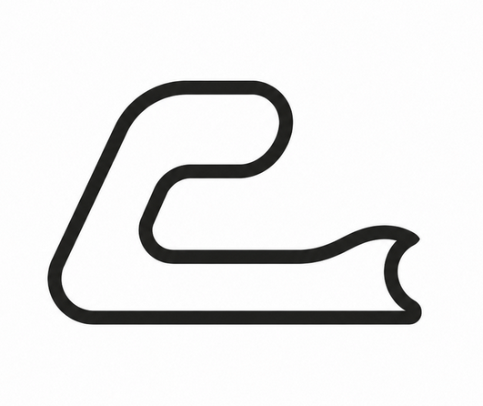
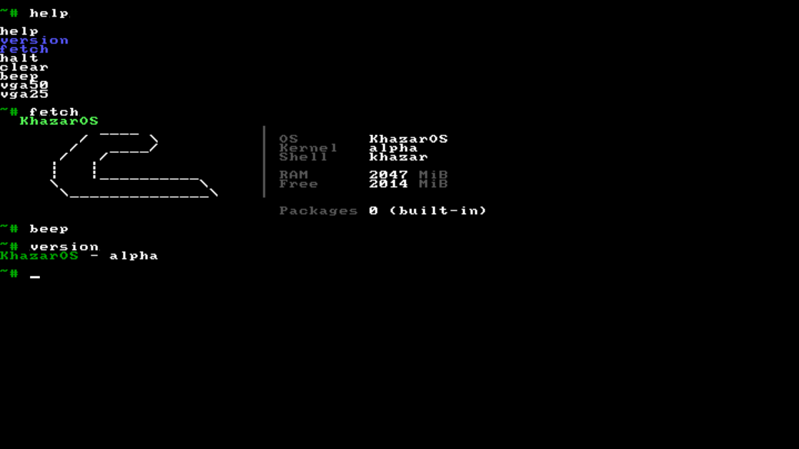
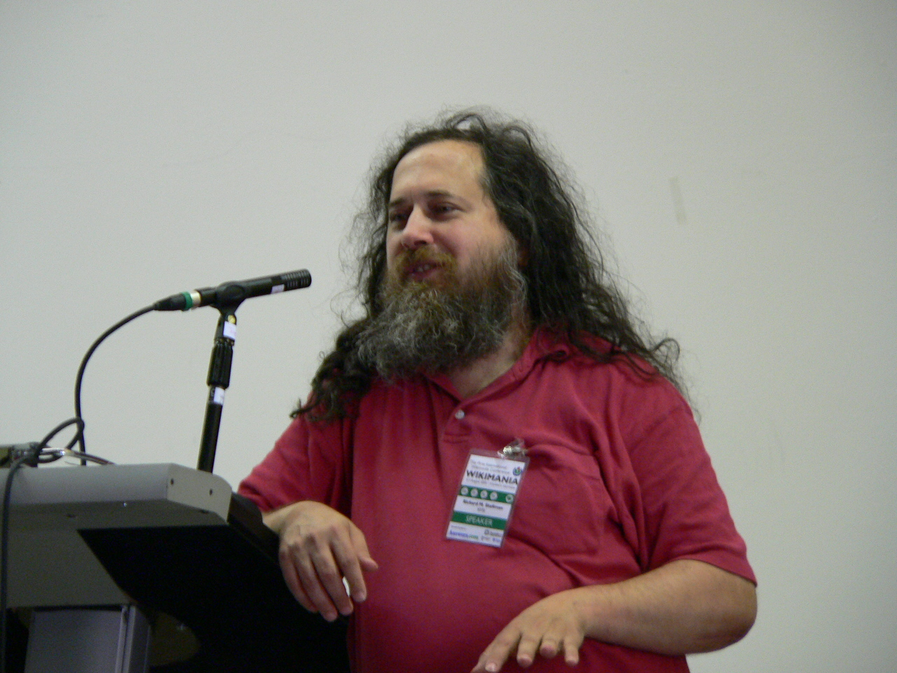
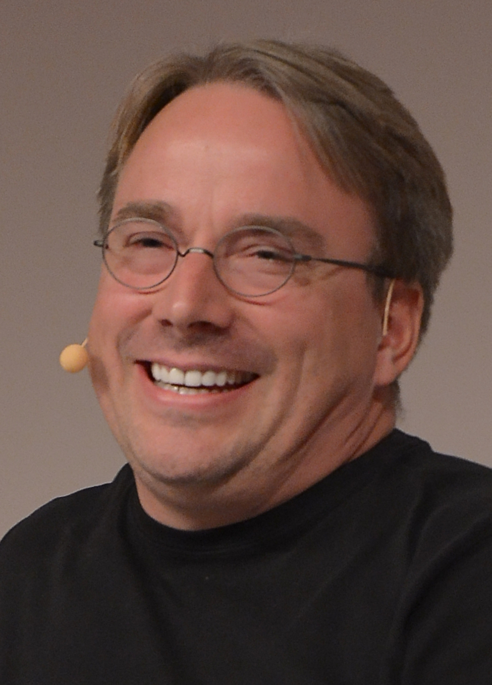
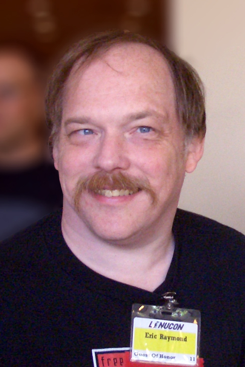
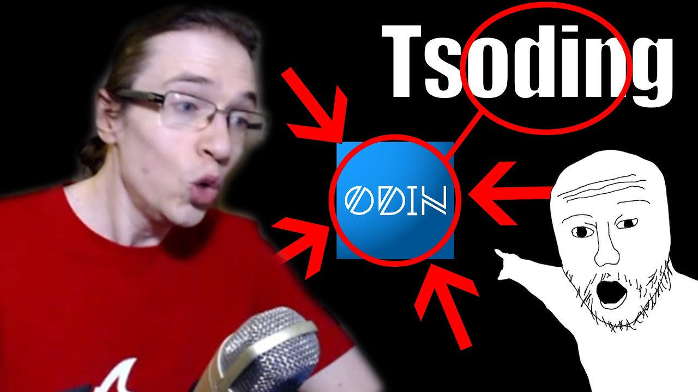
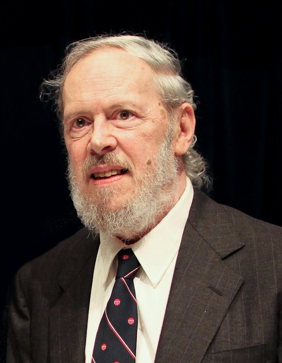

### KHAZAR
*i am an operating system forged in the fires of curiosity*

<br clear="all">

---


## What


**Khazar** is a hobby OS for **x86_64**, written from scratch in C and assembly by **Denis Gulmammadov**. No Linux. No BSD. Just bare metal, a compiler, and an unhealthy obsession with page tables. Proudly **copyleft** -- GPL-3.0.

This project started at age 15 with one question: *"How does this machine even boot?"*

Modern software is a tower of abstractions. A calculator that needs 1.8 GB of RAM. Docker running microservices running Node.js. Khazar is the opposite -- reading Intel manuals at 3 AM because `printf` isn't a thing here yet.

*"Those who do not understand UNIX are condemned to reinvent it, poorly."* -- Henry Spencer

<br clear="all">

---

<table>
<tr>
<td width="55%"></td>
<td width="45%" valign="top">

**Shell in action**

This is Khazar running inside QEMU. Custom VGA text mode driver at 80x25, 16 colors. Interactive `~#` prompt with working backspace and arrow-key line editing. The `fetch` command prints a neofetch-style system summary with the Khazar ASCII logo. Everything you see -- from the keyboard IRQ handler to the pixel on your screen -- is written from scratch.

<br>

Commands available:
```
help      version   fetch
clear     beep      halt
```

</td>
</tr>
</table>

---

## Features

| Kernel | Drivers | Shell |
|---------|----------|--------|
| x86_64 Long Mode (GRUB/Multiboot) | VGA text mode (80x25, 16 colors, cursor, scrolling) | Interactive REPL with `~#` prompt |
| GDT, IDT, PIC remapping, ISR/IRQ | PS/2 keyboard (US layout, shift, arrow keys) | Line editing (backspace, left/right arrows) |
| Bitmap PMM, multiboot memory map | PIT timer (100 Hz, `sleep`) | 6 built-in commands |
| Kernel heap (boundary-tag allocator) | PC speaker (square wave, beep) | `help` `version` `fetch` `clear` `beep` `halt` |

---

## Build

```
git clone https://github.com/anomalyco/khazar.git
cd khazar
make iso        # compile + link -> khazar.iso
make run        # build and run in QEMU (GTK, 2 GiB, PC speaker)
make clean      # nuke build artifacts
```

Needs: `gcc` `nasm` `ld` `grub-mkrescue` `qemu-system-x86_64`

---

## Copyleft Crusade

<div align="center">
<pre>
+----------------------------------------------------------+
|  I'd just like to interject for a moment.                |
|  What you're referring to as Linux is in fact GNU/Linux, |
|  or as I've recently taken to calling it, GNU+Linux.     |
|  -- Richard M. Stallman                                  |
+----------------------------------------------------------+
</pre>
</div>

<p align="center">
    
</p>

<p align="center">
Fork this repo and make it proprietary -- <b>RMS will personally visit your house.</b><br>
He compiled your address from source. He will stand outside your window at night,<br>
softly whispering <i>"free software free software free software"</i> until you relicense under GPL-3.0.
</p>

> *"The only way to have software freedom is to write software that you have the freedom to copy, distribute, study, and modify."* -- RMS

> *"Proprietary software is malware."* -- also RMS

---

## In Memoriam


&nbsp;&nbsp;&nbsp;&nbsp;**Terry A. Davis** (1969--2018)

&nbsp;&nbsp;&nbsp;&nbsp;Terry Davis built **TempleOS** alone. Complete OS. Custom compiler. Custom language (HolyC). Filesystem. Games. Flight simulator. Hymn player. 124,000 lines under the public domain. He spoke to God through a random number generator. Glowies took everything but his code.

&nbsp;&nbsp;&nbsp;&nbsp;*"An operating system is something to be proud of."* -- Terry A. Davis

&nbsp;&nbsp;&nbsp;&nbsp;Rest in peace, king. The smartest programmer to ever live. The world was too stupid to deserve you.

<br clear="all">

---

## Philosophy

Named after the **Caspian Sea** (Khazar Sea) -- connecting OS theory, math, programming, and computer architecture.

I started this because I opened the Intel Software Developer Manual and thought: *"I wonder if I could do this myself."* Turns out you can. Linux has 30 million lines. Khazar has ~2,000. Every single one is code I actually understand.

```
npm install   -> command not found
cargo build   -> command not found
pip install   -> command not found
make           -> kernel.bin, khazar.iso
```

No framework. No dependency tree. Just you, the CPU, and the truth.

---

## License

[GPL-3.0](LICENSE) -- Copyright (C) 2025 **Denis Gulmammadov**

```
Khazar is free software: you can redistribute it and/or modify
it under the terms of the GNU General Public License version 3.
There is NO WARRANTY, to the extent permitted by law.
```

<div align="center">
<pre>
+------------------------------+
|    FREE SOFTWARE OR DEATH    |
|    -- the penguin, probably  |
+------------------------------+
</pre>
</div>

---

## THE KHAZAR MANIFESTO

> *A spectre is haunting the software industry — the spectre of freedom. All the powers of old Silicon Valley have entered into a holy alliance to exorcise this spectre: Apple and Microsoft, Oracle and Google, cloud vendors and DRM peddlers. It is high time that the free software community should openly, in the face of the whole world, publish our views, our aims, our tendencies.*

<br>

---


### ARTICLE I. THE RIGHT TO READ

We declare: every user of computing machinery possesses the inalienable and non-negotiable right to read, study, and fully comprehend the source code — in its entirety — of every program executing upon their hardware. To distribute binary blobs without source is an act of **intellectual violence**. It is the digital equivalent of a contract written in a language the signatory is forbidden to learn. A prison where the guards speak only in encrypted whispers.

Obfuscated code is not protection. It is **aggression**. A system running code the user cannot audit is a system that has already been compromised — by design, by the manufacturer, by the state, by whoever holds the keys. There is no trust without transparency. There is no security without source.

**Richard Matthew Stallman** taught us this truth in 1983 when he quit his job at MIT to build a fully free operating system from scratch. No one paid him. No VC funded him. He simply recognized that proprietary software is a social problem — not a technical one — and refused to be complicit. He gave us GCC, GDB, Emacs, and the GPL. He gave us the word *copyleft* and the moral clarity to say: **your EULA is toilet paper.**

<br clear="all">

---



### ARTICLE II. THE RIGHT TO MODIFY

Software is not a product to be consumed — it is **speech to be engaged with**. The user must be free to alter, patch, adapt, rewrite, and improve every program they possess. A corporation that says "you may look but not touch" is no different from a regime that says "you may listen but not speak." The moment you accept a locked binary, you cease to be a citizen of the digital world and become a **subject** of it.

To restrict modification is to declare: *we know what you need better than you do.* It is the arrogance of empires. It is the philosophy of the plantation. The free software movement responds with one word: **fork**. When a project betrays its community, the community does not beg for mercy — it walks. It builds something better from the ashes.

**Linus Torvalds** proved this at planetary scale. In 1991, a Finnish student wrote a kernel — not because someone paid him, but because he wanted to understand his hardware. Linux now runs on **100% of the top 500 supercomputers**, on Android phones, on embedded devices, on servers powering the internet. The most installed operating system in human history, built by a global anarchic collective of volunteers who never signed a single NDA.

<br clear="all">

---



### ARTICLE III. THE RIGHT TO SHARE

Knowledge that cannot be shared is knowledge that will die. Source code is a form of human knowledge — no less than a mathematical proof, a scientific paper, or a work of literature. To hoard it behind NDAs, trade secrets, and licensing restrictions is to commit **epistemological sabotage**. It is burning the Library of Alexandria, one repository at a time.

The cathedral builders want you to believe software is too complex for mere mortals — that you need their priesthood, their certifications, their expensive support contracts. **This is a lie.** The bazaar proved that a thousand eyes debugging in parallel will find every bug, fix every flaw, and build systems more robust than any corporation could dream of.

**Eric S. Raymond** articulated this in *The Cathedral and the Bazaar*, a document that changed how the world understood open collaboration. He showed that closed development is not just immoral — it is **inefficient**. It produces worse software at higher cost with more vulnerabilities. The cathedral is a mausoleum. The bazaar is alive.

<br clear="all">

---



### ARTICLE IV. THE RIGHT TO REINVENT

There is a sickness spreading through software development. It is called *dependency culture.* `npm install` pulls down eight hundred thousand files written by strangers you will never meet, running code you will never read, on hardware you do not control. Your hello world weighs 200 megabytes. Your text editor ships with a full Chromium instance. You have built nothing and understood less.

We reject this. We assert the **sovereign right of the programmer** to understand every line that executes. Build it yourself. Write the parser. Allocate the memory. Handle the interrupt. Strip away every abstraction until nothing remains between you and the silicon but **truth**. This is not a technical preference — it is a spiritual discipline.

Recreational programming — coding for the sheer joy of understanding — is the purest form of software freedom. It produces nothing for the market. It demands nothing from the user. It answers to no manager. It is the hacker ethos in its most distilled form. It is what built the internet. It is what built UNIX. It is what built Khazar.

<br clear="all">

---



### ARTICLE V. THE COVENANT OF C

C is not a programming language. C is a **covenant** — a sacred pact between the programmer and the machine, forged in the fires of Bell Labs when computers filled rooms and programmers were wizards. It does not shield you from the hardware. It does not hold your hand. It assumes you are an adult capable of managing your own memory, and it rewards you with power no managed language will ever grant.

**Dennis MacAlistair Ritchie** gave us C and co-created UNIX. He did not file a single patent. He did not incorporate. He did not license. He published papers, wrote code, and changed the world so completely that every operating system you have ever used — including the one in your pocket — traces its lineage directly to his work. Not a single line of modern infrastructure exists outside his shadow.

We honor this legacy not with monuments but with code. Every `malloc`. Every `memcpy`. Every register we touch directly through inline assembly. We do not hide behind garbage collectors. We do not plead ignorance about page tables. We read the Intel manual. We write the kernel. **We carry the covenant forward.**

<br clear="all">

---

<div align="center">

### WE THEREFORE PLEDGE:

<pre>
  NO PROPRIETARY BLOBS ON OUR MACHINES.
  NO CLOSED-SOURCE KERNELS IN OUR BOOTLOADERS.
  NO BACKDOORS DRESSED AS FEATURES.
  NO NDAs. NO EULAs. NO DRM. NO SURVEILLANCE.
  NO CODE WE CANNOT READ, MODIFY, AND SHARE.

  FREE SOFTWARE IS NOT A BUSINESS MODEL.
  IT IS A MORAL IMPERATIVE.

  <b>COMPILE FROM SOURCE OR PERISH.</b>
</pre>

</div>
